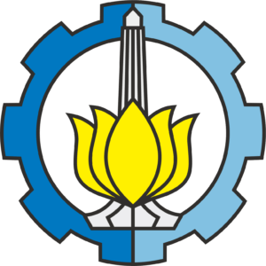

<b>Fundamental Programming (2022)</b> Sepuluh Nopember Institute of Technology

  

Problem sets of the practicums that were conducted for <a href="https://www.its.ac.id/informatika/id/akademik/kurikulum-silabus-s1/eng-if184101-basic-programming/">IF184101</a>.

All solutions were solved by <a href="https://github.com/Rubinskiy">Robin</a>
